# Phase A — final report

Phase A of the product plan (A0–A4) is done: one game with a pure rules core
and two renderers (the existing three.js 3D view and a new Canvas 2D view),
fairer controls, honest loss reasons, a Turkish/English UI, a first-session
guide, save v2 with a resumable game, and a lifecycle pause.

At the owner's request, `main` was fast-forwarded to `d8d1be8` on 2026-09-23
and the GitHub Pages workflow deployed it (run #6, success). The files served at
https://keremcan534.github.io/cargo-panic/ were compared byte for byte with
the local build of that commit: all 5 are identical. Later commits in this
report (review fixes, the title-screen fix, this report) are on
`claude/cargo-panic-product-plan-o520h6` and are **not** on `main` or Pages.

The starting point, the commands run before any change and the checks of the
plan's claims against the code are in [A0-baseline.md](A0-baseline.md).

## Contents

1. [What was built](#what-was-built)
2. [Requirement → code → test](#requirement--code--test)
3. [Commands actually run](#commands-actually-run)
4. [Screenshots (2D and 3D)](#screenshots-2d-and-3d)
5. [Changed files](#changed-files)
6. [Known bugs and limits](#known-bugs-and-limits)
7. [Not tried on a real device / not verified](#not-tried-on-a-real-device--not-verified)
8. [Risks](#risks)
9. [Before Phase B](#before-phase-b)

## What was built

### A1 — pure game session, 3D behind a view contract

- `src/game/session/GameSession.ts` owns the committed board, the belt queue,
  the hazard clocks, the active-play clock, assists and the phase. It takes
  semantic commands only (`move(id, shelf, slot)`, `toBelt`, `hold`/`release`,
  `undo`, `hint`, `pause`/`resume`, `advance(realMs)`), each atomic. It imports
  neither three.js nor the DOM (checked by `tests/unit/architecture.test.ts`).
- Picking a package up no longer changes the board. Before, `beginDrag`
  removed the crate from the placements, so holding a crate off a red rack
  paused or refilled the hazard clock. Now the hazard keeps running on the
  committed board until a real move changes it.
- Rules clocks run on real time in 50 ms sub-steps (capped at 250 ms per
  frame), so a slow frame rate no longer hands out extra seconds, and time
  spent hidden is never charged.
- Snapshots carry the ruleset and generator versions, are validated field by
  field on restore, and always come back paused.
- All three.js code moved under `src/render/three/` behind `GameView`/`Stage`;
  one `FrameLoop` drives everything. GPU resources are now disposed by owner
  (the A0 leak: geometries/materials never freed, a material cloned on every
  board refresh).

### A2 — Canvas 2D view and safe switching

- `src/render/canvas2d/` draws the same board snapshot: front view, thick
  shelves, large weight numbers, type icons plus shape/texture (colour is never
  the only signal), landing squash, collapse and shatter, night-warehouse
  backdrop. Hit-testing shares one set of slot formulas with 3D
  (`src/render/layout.ts`).
- three.js is lazy: a 2D start does not fetch the three.js chunk and creates no
  WebGL context (browser-tested). `index` chunk 209 kB (67.8 kB gz); three.js
  488 kB (123 kB gz) and the 3D stage 67 kB load only when 3D is chosen.
- View switching from PAUSE (and the menu settings): cancel the drag,
  snapshot, dispose the old view by ownership, open the new one on the same
  snapshot, stay paused. 3D failing to start, the 3D chunk failing to load, or
  a WebGL context lost for 2 s all continue in 2D with the same session.
- 3D quality Auto/Low/High, separate from the view. Slow 3D first lowers
  quality, then offers 2D **between** shipments only.

### Ruleset 2 (rules change, versioned)

- A refused drop costs no stars and no clean bonus (it changes nothing).
- Undo does not cap stars; a hint caps the result at 2 stars.
- `RULESET_VERSION = 2`. Endless records made under ruleset 1 are kept apart
  and shown on the menu as "previous rules"; nothing is mixed or lowered.

### A3 — fair controls, retry, accessibility, first session

- Tap a package, then tap a slot (or the belt). Both paths go through the same
  commands and validator; a tap commits only the target that was shown while
  the finger was down. One active pointer; pointercancel, blur, resize and a
  hidden page put a held package back without duplicating it.
- One free UNDO per shipment; a reload does not renew it.
- Loss panels state real numbers ("The top shelf carried 12 against a rating
  of 8.") and highlight the shelf or crate. Run over: RETRY SAME SHIFT (same
  seed, from wave 1) and NEW SHIFT (new seed).
- REDUCED MOTION (System/On/Off): no camera shake, less glow, no heavy
  particles, no rack sway; hazard info stays as text and an icon. LANGUAGE
  (System/English/Türkçe); every player-facing string goes through
  `src/i18n` with complete Turkish.
- Guide for levels 1–3 (place; balance preview; fix by moving a stowed box),
  shown as a pointer and one short line, gone when the player does it, SKIP
  always reachable, flags saved. First-encounter notes for heavy, fragile,
  long and priority cargo. No upsell of any kind anywhere (no ads, store or
  missions exist).

### A4 — save v2, resumable game, lifecycle

- Save v2 (`src/game/save`): the v1 save migrates with every field kept; the
  v1 key is left untouched and a copy is set aside. Every write rotates a
  backup and carries a checksum; unreadable data is quarantined, never
  overwritten; a save from a newer build is read-only. Writes are coalesced and
  happen on commits, rewards and lifecycle boundaries, never per frame.
- The game in progress (board, queue, hazard clocks, assists, undo right,
  Endless run) is saved and offered as CONTINUE. It comes back paused with
  "Paused while you were away. Nothing moved."; only RESUME starts the clocks.
- A cleared Endless wave is banked through one claim: reward, next wave and the
  saved game are written together, so a reload, double tap or repeated outcome
  cannot pay twice.
- Hidden page / app in background: drop the held package, pause, save and
  flush, stop sound. Coming back resumes nothing. Win, loss and between-wave
  delays run on the frame clock, so they freeze while hidden.
- Save problems are shown: a card at boot for a recovered backup, an
  unreadable save or a newer version, and a persistent "Progress cannot be
  saved" banner while writes fail.
- Escape and the Android back button toggle pause (back first acknowledges a
  save card; on the menu it lets the app exit). The native path is wired but
  not installed or exercised — see below.

## Requirement → code → test

Browser tests run in headless desktop Chromium with a phone viewport and
emulated touch (Pixel 7 unless stated). They are functional checks, not device
or performance results.

| Requirement (brief) | Where | Test that proves it |
| --- | --- | --- |
| Same start + same commands → same board, score, hazard | `GameSession` | `session.test.ts` (determinism, snapshots) |
| Selecting/holding does not change the board or stop a hazard | `GameSession.hold` | `session.test.ts`; `play-3d.spec` "level 4: the hazard clock keeps running while the offending crate is held" |
| Invalid target changes nothing, costs nothing | session + ruleset 2 | `a3-controls` "a refused drop says why and changes nothing; level 1 still earns 3 stars" |
| Paused → active time does not grow | `GameSession.advance` | `session.test.ts`, `frameloop.test.ts` |
| Core imports neither three.js nor DOM | `src/game/**` | `architecture.test.ts` |
| 2D boot: no WebGL context, no 3D renderer | `createStage`, lazy import | `views-2d` "2D boot: no WebGL context, no three.js chunk…" |
| Same command sequence → same state in both views | shared layout + session | `views-parity` (levels and Endless seed 12345) |
| Settings mid-drag loses no package | `StageHost` switch | `views-switch` "switching view mid-drag loses and duplicates nothing" |
| 20 switches → one draw loop | `FrameLoop`, `StageHost` | `views-switch` "20 view switches: one canvas, one draw loop…" |
| WebGL error → same save opens in 2D | `createStage` fallback | `views-fallback` (no WebGL, chunk failure, context loss) |
| Second finger cannot steal the package | `InteractionController` | `interaction.test.ts`; `a3-controls` "a second finger cannot steal, aim or drop…" (mutation-checked) |
| pointercancel does not duplicate | `InteractionController` | `a3-controls` "a cancelled touch mid-drag…" (mutation-checked) |
| Long package commits only if it fits; all cells shown | session + views | `session.test.ts`; `canvas2d-harness` "a long package shows all three cells" |
| Undo once; not renewed by reopening; cannot clear assisted | session, `activePlay` | `a3-controls` UNDO tests; `a4-resume` "an undo used before a reload stays used" (mutation-checked) |
| Retry same shift keeps the seed; new shift changes it | `Game.ts`, `RunManager` | `a3-panels` "run over - RETRY SAME SHIFT … NEW SHIFT …" |
| Real loss reason, highlighted | `Game.ts`, views | `a3-panels` "an overload loss names the shelf and its real load and rating" (2D and 3D) |
| No ad/store popup in levels 1–3; guide not repeated; SKIP works | `Tutorial`, `tutorialFlow` | `a3-panels` guide tests; `tutorial.test.ts` |
| Reduced motion | both views, CSS | `a3-panels` "REDUCED MOTION is stored…"; `three-motion.test.ts` |
| TR/EN dictionary | `src/i18n` | `i18n.test.ts` (keys and placeholder parity); `a3-panels` Turkish at 360×640 |
| v1 migration keeps all progress | `SaveStore`, `schema.ts` | `save.test.ts`; `save-migration.spec` |
| Corrupt save → backup, or a clear message; never a silent reset | `SaveStore` | `save.test.ts`; `a4-resume` damaged / unreadable save tests |
| Timers do not advance while hidden or closed | `FrameLoop`, `PauseReasons`, `FrameTimers` | `a4-resume` "reload mid-shipment…", "hidden for 3 s…"; `frametimers.test.ts` |
| A rewarded wave never pays again on resume | `activePlay.bankWave`, `claim` | `activeplay.test.ts` (atomic claim); `a4-resume` "a cleared wave is paid once" (mutation-checked) |
| Save failure shows "Progress cannot be saved" | `SaveNotices` | `a4-resume` write-failure test |
| Browser reload and native restart reported separately | — | browser reload: tested; native: **not tested** (see below) |

## Commands actually run

On `23aeeb0`, the last code commit of this branch (the commit that adds this
report changes only `docs/`):

| Command | Result |
| --- | --- |
| `npx tsc --noEmit` | OK |
| `npm test` | 244 tests, 244 pass, 0 fail |
| `npm run build` | OK. `index` 209.4 kB (67.8 kB gz), CSS 25.2 kB; loaded only for 3D: `ThreeStage` 67.4 kB (19.8 kB gz), `three` 488.5 kB (122.7 kB gz) |
| `npm run validate` | All 25 levels solvable and three-star reachable |
| `npm run validate:endless -- 40 40` | 1,600 waves sound, 0 fallbacks, avg 7.8 ms, worst 278.8 ms |
| `npm run test:e2e` (full suite, 84 tests) | 84 passed (19.1 min), exit 0 |

Earlier full runs on the way (each on its own commit): 58/58 after A3,
62/62 after the A3 review fixes, 73/73 after A4, 77/77 with the title-screen
fix, 80/80 with the A4 review fixes. One browser test (the A3 "cargo note
waits while a danger runs") failed about 1 run in 12 on `d8d1be8`: it tapped a
crate during its 0.4 s landing tween. The test now waits for the crate to land
(15/15 after); the behaviour behind it is listed under known bugs.

On `d8d1be8` (what `main` and Pages run): `tsc` OK; `npm test` 230/230;
build OK; validate 25/25 solvable and 3-star reachable; validate:endless 1,600
waves sound, 0 fallbacks; full browser suite 73/73 (16.5 min). The Pages
workflow's steps (`npm ci`, both validators, build) were replayed on a clean
`git archive` export of that commit: all passed. The build was also served
under `/cargo-panic/` (as Pages does) and level 1 opened in 2D and 3D with no
page errors and no failed requests.

Mutation checks (a guard removed, the test seen failing, the guard restored):
second-finger guard, pointercancel handling, tap-commit-what-was-shown, undo
once, undo not renewed on restore, the claim for a wave reward, pause on hide,
restored game starting paused, the write-failed banner, and each review fix
that has a regression test.

Generation and solver times are from this container's CPU under Node, not a
phone.

## Screenshots (2D and 3D)

Taken by the browser tests in headless Chromium on `23aeeb0` (menus: `67ba74b`,
same menu code), halved and saved as JPEG in [screenshots/](screenshots/).
Sizes are CSS pixels; "Pixel 7" is 412×839.

### 2D (Canvas)

| | | |
| --- | --- | --- |
| 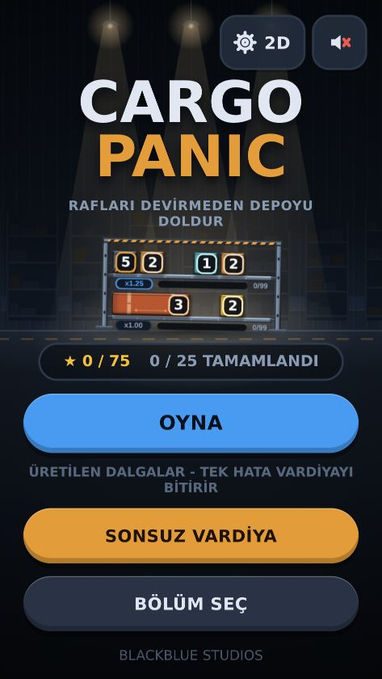 | 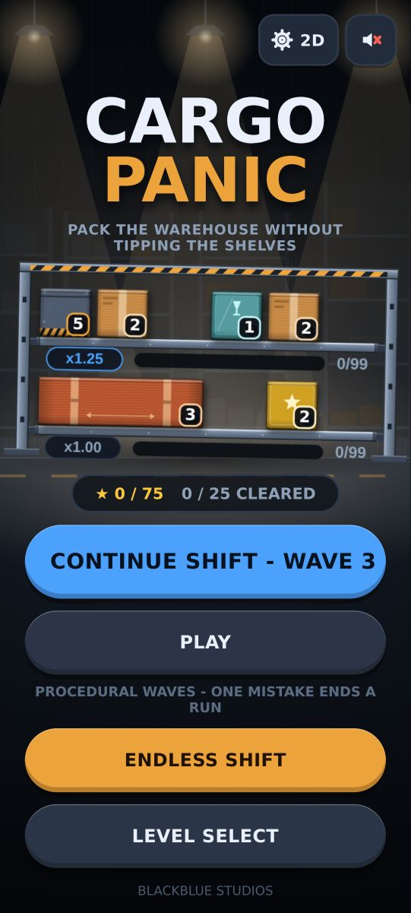 | 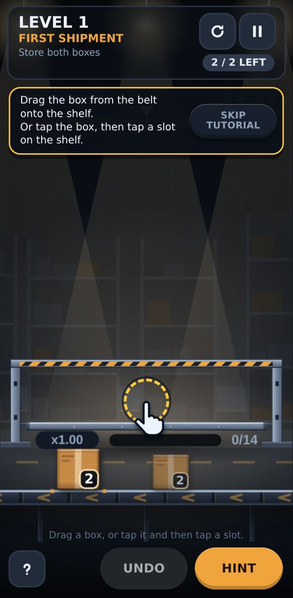 |
| Menu, Turkish, 360×640 | Menu with CONTINUE, 412×915 | Level 1 guide (Pixel 7) |
| 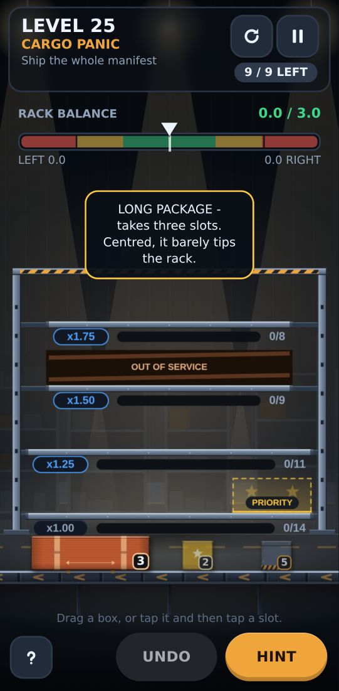 | 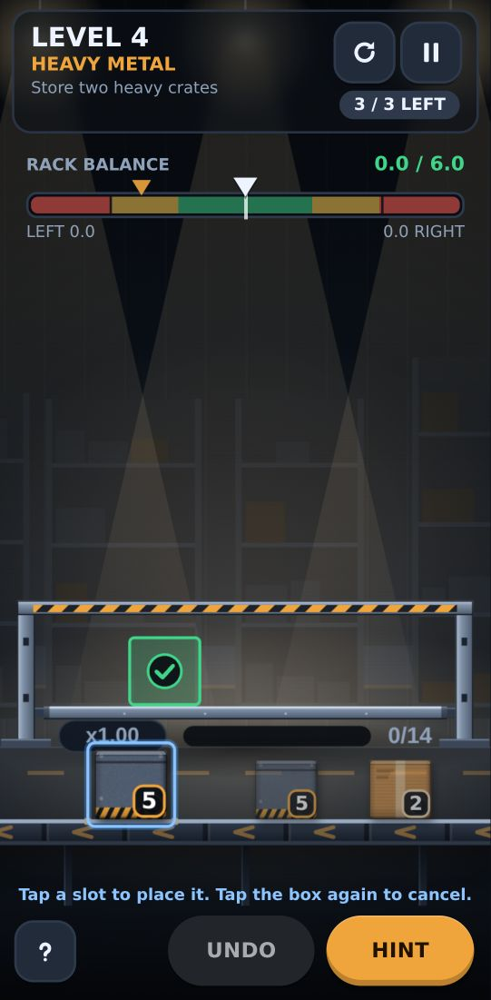 | 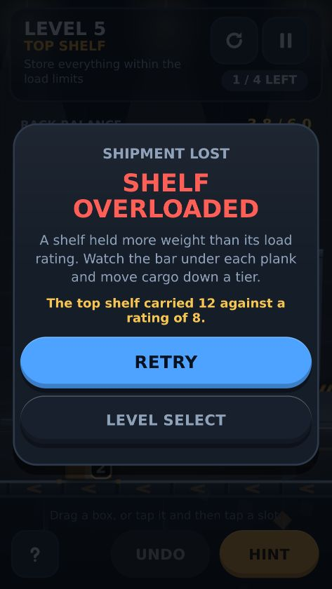 |
| Level 25 (Pixel 7) | Tap-selected crate and its target (Pixel 7) | Loss panel with the real load, 360×640 |
| 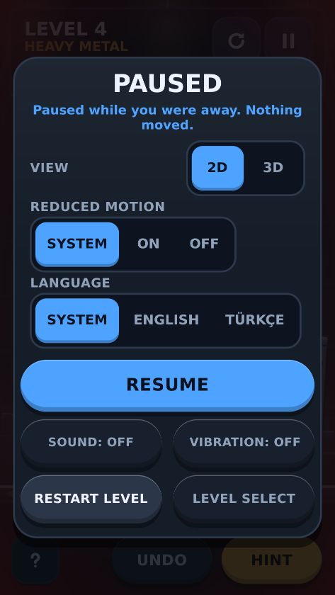 | 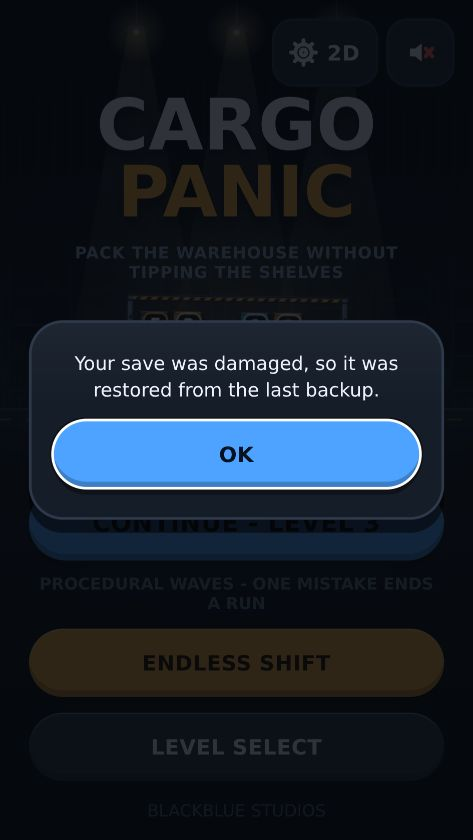 | 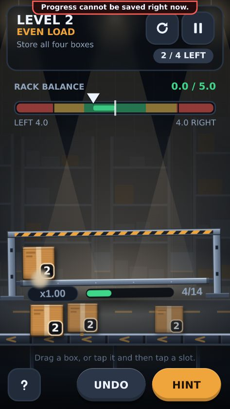 |
| CONTINUE after a reload: paused, "away" note, 360×640 | Damaged save restored from backup, 360×640 | Writes failing: banner, game goes on, 360×640 |

### 3D (three.js)

| | | |
| --- | --- | --- |
| 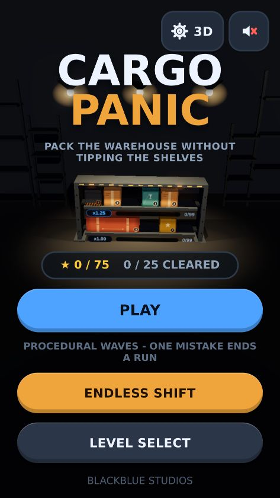 | 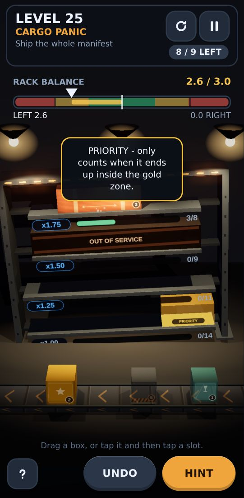 | 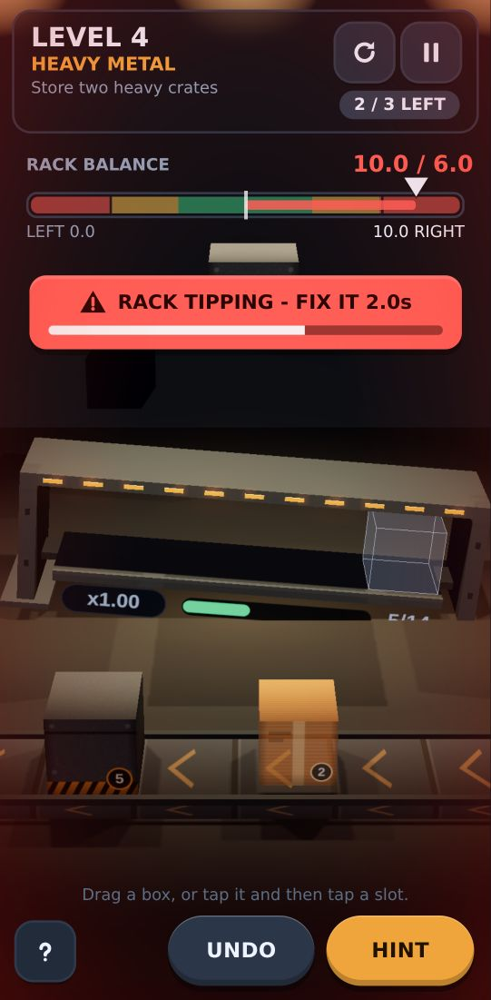 |
| Menu, 360×640 (rack fitted between tagline and buttons) | Level 25 (Pixel 7) | Level 4: the hazard keeps counting while a crate is held (Pixel 7) |
| 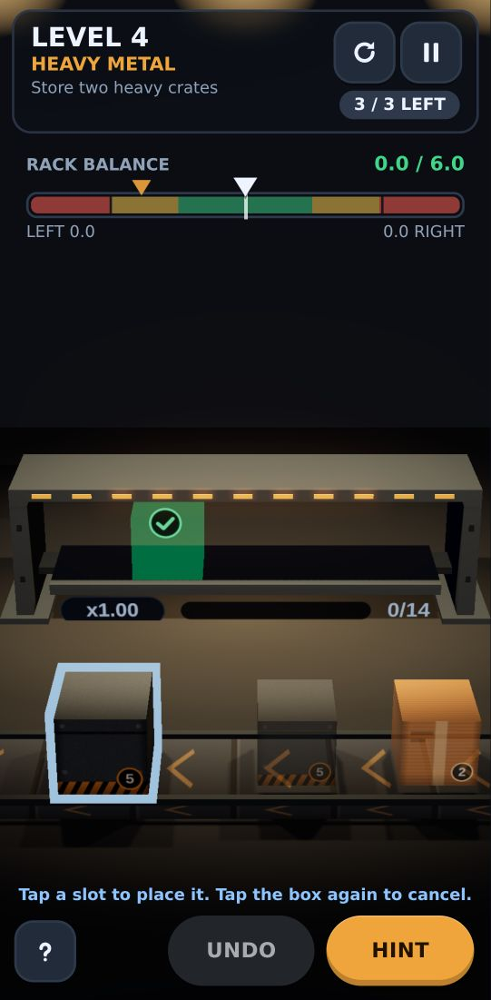 | 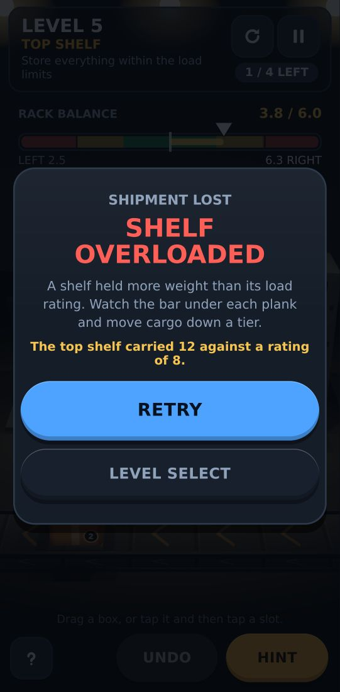 | 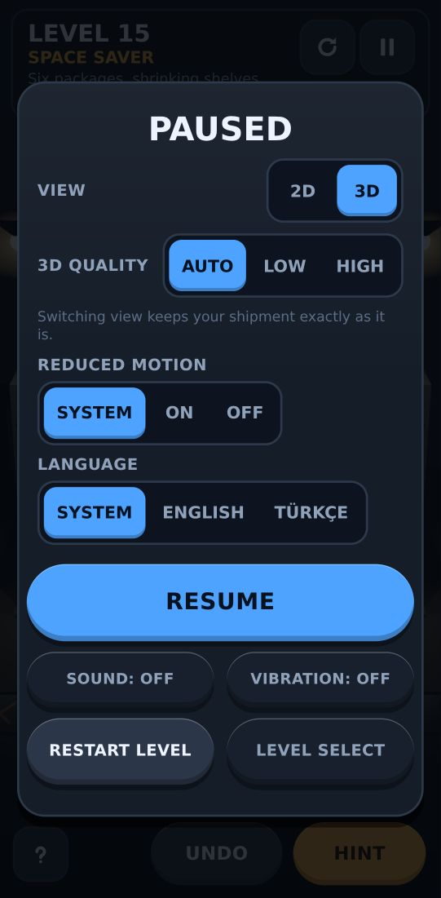 |
| Tap-selected crate and its target (Pixel 7) | Loss panel (Pixel 7) | Pause: view, 3D quality, reduced motion, language (Pixel 7) |

## Changed files

`git diff --stat 506ba05..23aeeb0`: 127 files changed, 22,869 insertions,
1,710 deletions (this report and its screenshots come on top). Per-commit
detail is in `git log 506ba05..` (small commits, one concern each).

**Rules core (new, pure)** — `src/game/session/{GameSession,rules,run,types,versions,fingerprint,index}.ts`

**Save and platform (new)** — `src/game/save/{SaveStore,schema}.ts`,
`src/platform/{storage,lifecycle}.ts`

**Systems (changed)** — `src/game/systems/{BalanceSystem,HazardSystem,PlacementSystem,RunManager,ProgressManager,AudioManager}.ts`,
`src/game/config.ts`

**App layer** — new: `src/app/{App,FrameLoop,FrameTimers,PauseReasons,Preferences,StageHost,activePlay}.ts`;
changed: `src/app/{Game,Router}.ts`, `src/main.ts`

**Input (new)** — `src/input/InteractionController.ts`

**Text (new)** — `src/i18n/{en,tr,index}.ts`

**Render contracts and shared layout (new)** — `src/render/{GameView,Stage,createStage,layout,quality,hero}.ts`,
`src/render/art/{cargoArt,icons}.ts` (`cargoArt` grew out of the old `render/Materials.ts`)

**Canvas 2D view (new)** — `src/render/canvas2d/{Canvas2DStage,Canvas2DGameView,Particles2D,backdrops2d,layout2d,lean2d,rack2d,sprites2d,types2d}.ts`

**three.js view** — moved under `src/render/three/`: `Framing`, `Particles`,
`Warehouse`, `world/{Conveyor3D,Rack3D,Shelf3D}` (from `src/render/` and
`src/world/`); new: `ThreeStage`, `ThreeGameView`, `Materials`, `backdrops`,
`dispose`, `world/Cargo3D`; removed: `src/render/Renderer.ts`,
`src/world/Cargo3D.ts` (replaced)

**UI** — new: `src/ui/{Notice,SaveNotices,Tutorial,tutorialFlow,ViewSettings,heroBand}.ts`;
changed: `src/ui/{Hud,LevelSelect,Menu,Meter,Panels,dom}.ts`, `src/style.css`

**Tests and tooling (new)** — `tests/unit/*.test.ts` (20 files),
`tests/e2e/*.spec.ts` (13 files) and `tests/e2e/support/{game,save}.ts`,
`tests/harness/*` (2D renderer harness), `tests/fixtures/baseline.json`,
`playwright.config.ts`, `scripts/baseline-snapshot.ts`,
`scripts/lib/{baseline,import-graph}.ts`, `src/vite-env.d.ts`

**Config and docs (changed)** — `package.json` and `package-lock.json`
(`@playwright/test` 1.56.1 and the `test`/`test:e2e`/`baseline` scripts only;
no runtime dependency added), `tsconfig.json`, `.gitignore`, `README.md`;
new: `docs/phase-a/*`

## Known bugs and limits

None of these loses progress, pays a reward twice or changes a rule.
Adversarial review passes over the design, A1/A2, A3 and A4, with every
finding checked by a second reviewer against the code, found about 30 real
defects. All were fixed, most with a regression test that fails without the
fix, except the low-severity items below.

**Gameplay and input**
- A tap on a crate during its ~0.4 s landing tween hits where the crate is
  going (the committed board), not where it is drawn, so it can select the
  next belt package instead. The browser test was flaky on this until it
  waited for the landing.
- A level tile in the level select starts that level fresh, even over a saved
  game of the same level, without asking (the button under the grid resumes
  it). Starting fresh over an Endless shift with points does ask.
- Leaving a continued game from the "away" pause panel with EXIT, without
  pressing RESUME, means its opening note (wave intro or level tip) is never
  shown for that shipment.
- END RUN, or starting fresh over a shift, does not record that shift's score
  (existing behaviour; the confirmation text says so).
- In Endless, the per-package dispatch order can differ between 2D and 3D when
  the rack leans (cosmetic; the score is computed once by the session).

**Text and layout**
- A live language switch does not redraw the shelf plaque text in either view
  or a tip card already on screen; they switch on the next level. A save
  message card keeps its language too.
- The first-encounter cargo note replaces the level tip or the Endless wave
  intro when both would show at once.
- At 360 px wide the Turkish controls line wraps to two lines and touches the
  belt's lower edge; 3D weight numbers on cargo are about 12 CSS px, at the
  readability threshold.
- The 2D level 1 layout sits low, leaving a large empty band above the rack.
- In 3D level 25 the bottom shelf's "x1.00" plaque is partly under the belt
  band, and a tip card covers the top shelf until it fades (4.6 s).
- The menu is not built for landscape: its buttons run off the bottom. The
  title rack is hidden there rather than overlapping.
- In 3D, when the title rack has to shrink (360×640 without CONTINUE), the
  whole picture zooms out and the ceiling lamps show behind "PANIC".
- After a resize the title rack can be drawn for one frame with the old fit.
- The guide's SKIP button, once the card has been read, sits over the "RACK
  BALANCE" label while nothing is held.

**Notices and panels**
- The slow-3D "try 2D?" suggestion shows at most once per run and is not
  remembered across launches.
- The context-loss notice reuses the "switched to 2D" wording.
- A notice can cover the HINT button for about 6.5 s; the slow-3D suggestion
  card overlaps the top of the win panel.
- The save message card does not trap keyboard focus.

**3D internals**
- Returning a package to the belt snaps it in from the left; mounting the 3D
  view eases into the rack's lean instead of snapping to it.
- Each screen's warehouse lights grow three.js's internal light-uniform cache
  a little. GPU geometry/texture counts are checked and stay flat
  (`play-3d` "restarting a level and switching screens does not grow GPU
  resources"), but this cache is not.
- Turning REDUCED MOTION on mid-shipment in 3D does not stop a hint pulse that
  is already running (it ends by itself within 4.2 s).

## Not tried on a real device / not verified

- **No real device of any kind.** Everything ran in headless desktop Chromium
  (SwiftShader WebGL, ~1–2 fps in 3D), with touch emulated through DevTools.
- **No Android build.** There is no `android/` project and no Capacitor
  package installed; only `capacitor.config.json` exists. The native lifecycle
  (app state, back button, process restart) is wired to the Capacitor App
  plugin when present, and one browser test checks that wiring against a
  **fake** plugin. That is not a native test.
- **A real background tab.** Headless tests fake `visibilityState = 'hidden'`
  while frames keep running; that makes the pause check stricter, but that the
  frame-clock delays freeze in a real background tab is covered by unit tests
  only.
- **Performance.** No FPS, p95 frame time, long-frame or memory measurement on
  any device. The targets in the brief (60 fps mid-range, ≥30 fps 2D entry
  level, no growth over 15 min) are **not measured**. The 20-switch test only
  shows one draw loop and stable GPU object counts in headless Chromium.
- **Wave generation on the main thread.** Worst case 262–605 ms for a single wave (across runs) on
  this CPU under Node; whether that hitches on a phone is unmeasured, so no
  Worker was added.
- **"First correct placement within 15 s"** was not measured with players.
- **Screen reader, tablet, notched safe areas, WebView vs browser** were not
  tested. Small phone (360×640), tall phone (412×915) and landscape were
  checked in the browser only.

## Risks

The brief's five risks, as they stand:

1. **Same reward twice** — covered for web: reward id claimed once, written
   atomically with the next wave and the saved game; tested across reload in
   the dispatch and mid-wave. A native callback repeat was not exercised.
2. **2D/3D rule divergence** — both views issue the same semantic commands to
   one session; parity tests replay the same commands in both views and
   compare state after every step.
3. **Loss in background / save loss** — web visibility, reload, corrupt data
   and failing writes are tested; screen lock, notification shade and process
   death on a device are not.
4. **Solvable but unplayable content** — the solver proves every level and
   every generated wave solvable; readability at 360 px is checked by
   screenshots only.
5. **Daily time/version skew** — Phase B; saves already carry ruleset and
   generator versions and refuse to resume across a mismatch.

## Before Phase B

In order of importance:

1. **A device pass.** Add the Capacitor Android project and the App plugin,
   then test on at least one entry-level and one mid-range phone: screen lock,
   notification shade, app switch, process death and CONTINUE, the back
   button, safe areas, a tablet, and Chrome vs the WebView. Everything native
   in this report is untested.
2. **Measure performance on those devices** before building more on top: FPS,
   p95 frame time, long frames, memory over 15 minutes and over 20 view
   switches, and the wave-generation hitch (262–605 ms worst case on this
   CPU). Decide on a Worker for generation from those numbers only.
3. **Run the unit and browser tests in CI.** The Pages workflow runs the
   validators and the build, not `npm test` or `npm run test:e2e`. Browser
   tests take 15–25 min headless; the unit tests take seconds and could gate
   the deploy today.
4. **Watch a few real first sessions.** The "first correct placement within
   15 s" target is unmeasured, as is whether players find tap-to-place.
5. **Close the known issues that players will meet first:** the live language
   switch, level tiles over a saved game, the landscape menu, and the 2D level 1
   layout.
6. **Phase B scoring is a new ruleset.** The new star thresholds (0.70 / 0.40
   of tolerance), the Mastery badge and the clean-shipment definition need
   `RULESET_VERSION = 3`, with ruleset 2 records kept as "previous rules" the
   way ruleset 1 records are now. Earned campaign stars must never go down.
7. **Every Phase B reward goes through `progress.claim(rewardId, …)`** with
   the state change in the same write, as the Endless wave bank does now.
   Coins, missions and contracts need their own "paid once" tests across reload
   and a repeated native callback.
8. **Daily mode needs a trusted date and a pinned generator.** Saves already
   carry the ruleset and generator versions and refuse to resume across a
   mismatch; the daily seed and its date source do not exist yet.
9. **No ad, analytics or store integration exists.** There are no keys or ids
   in the repository, and the hint gate (`HintService.setHintGate`) is the
   only hook. Phase B/C must add them behind real accounts, not placeholders.
